# QChatSampleActivity 架構解析

## 架構圖

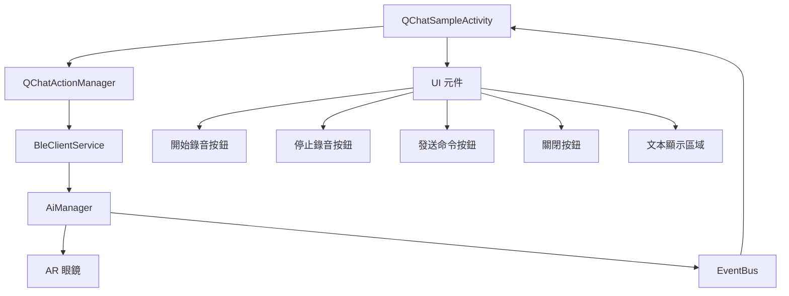

## 流程圖

### 開始錄音流程

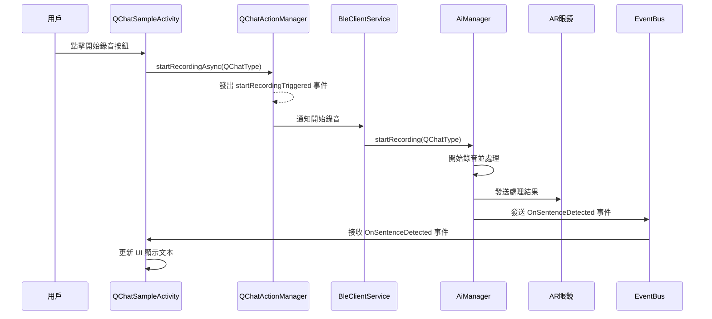

### 停止錄音流程

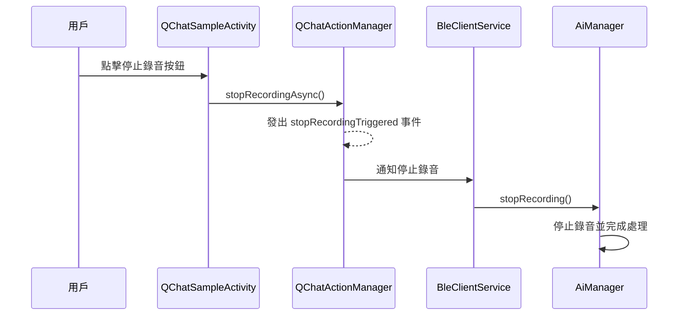

### 發送命令流程

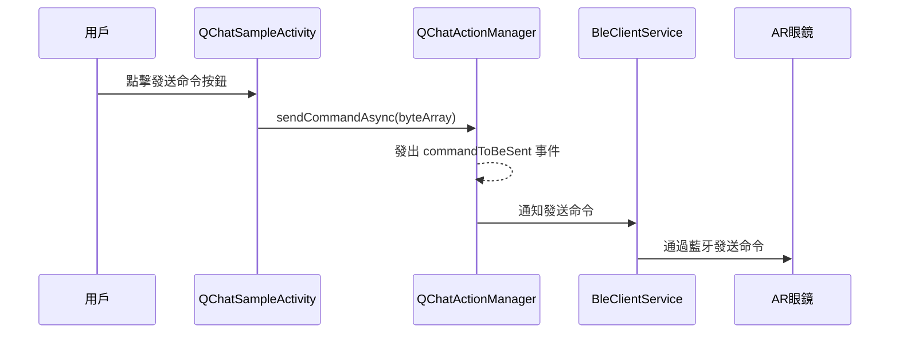

### 關閉活動流程

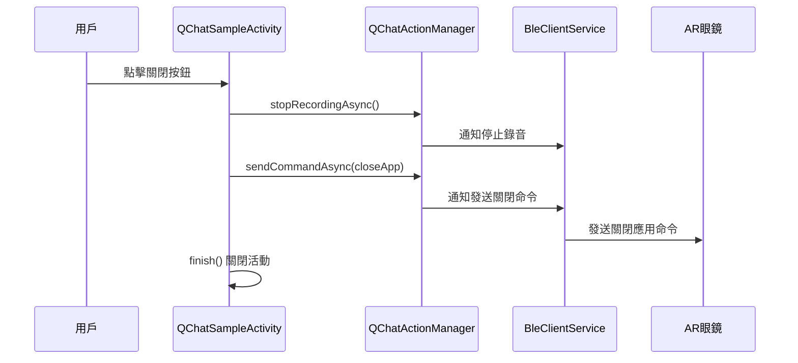

## 模組圖

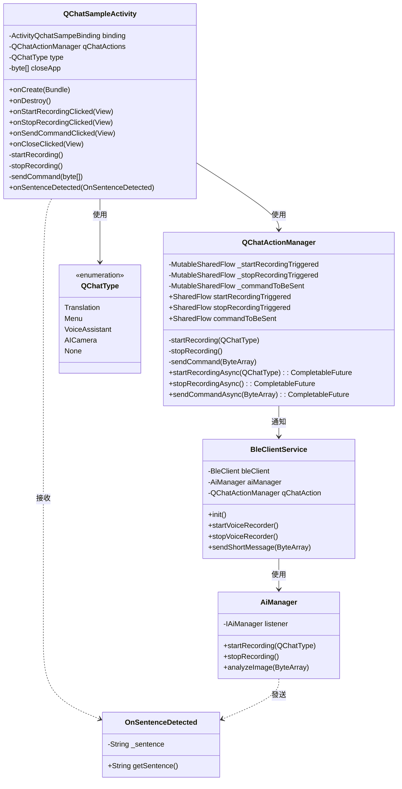

## QChatSampleActivity 功能模組

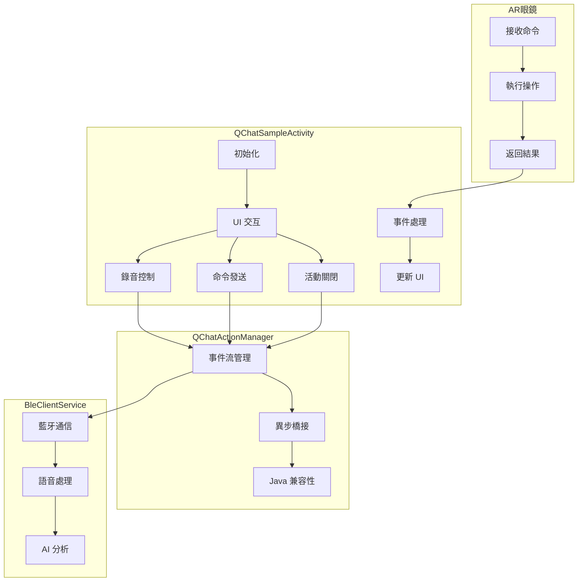

## QChatType 與功能對應

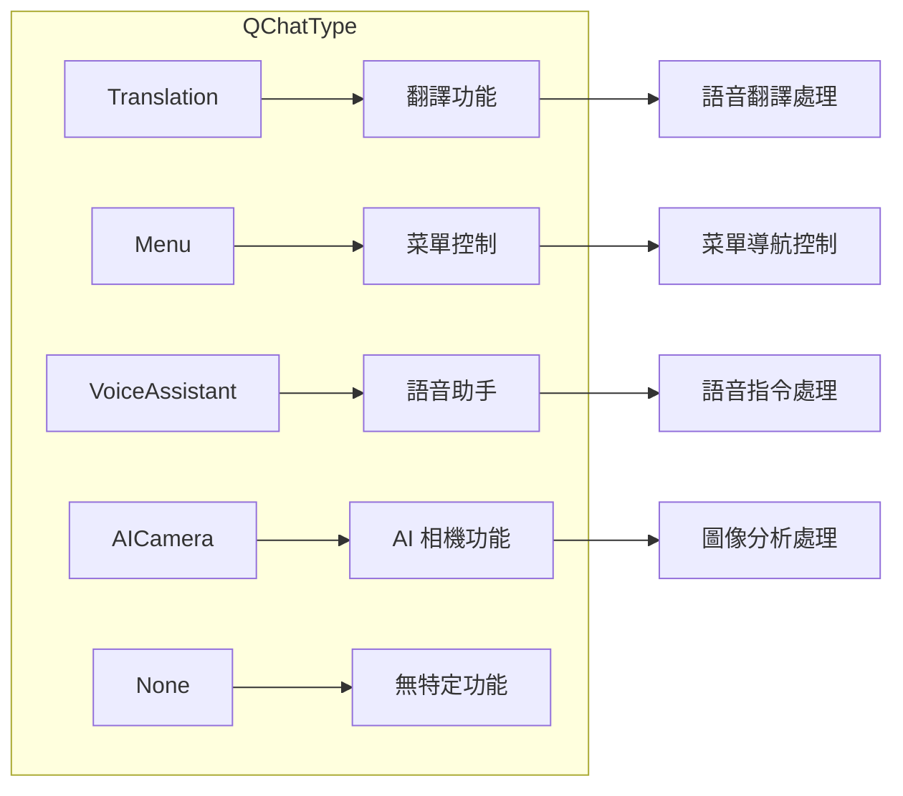

## 數據流向圖

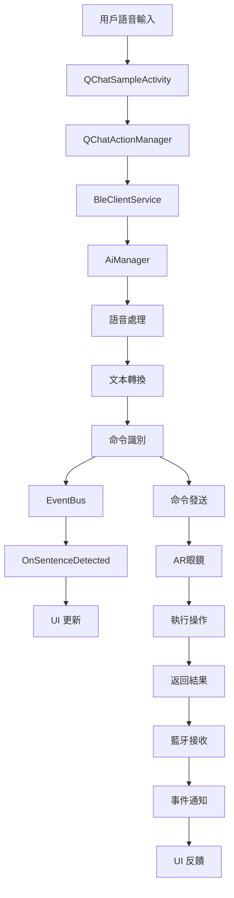

## 組件交互關係

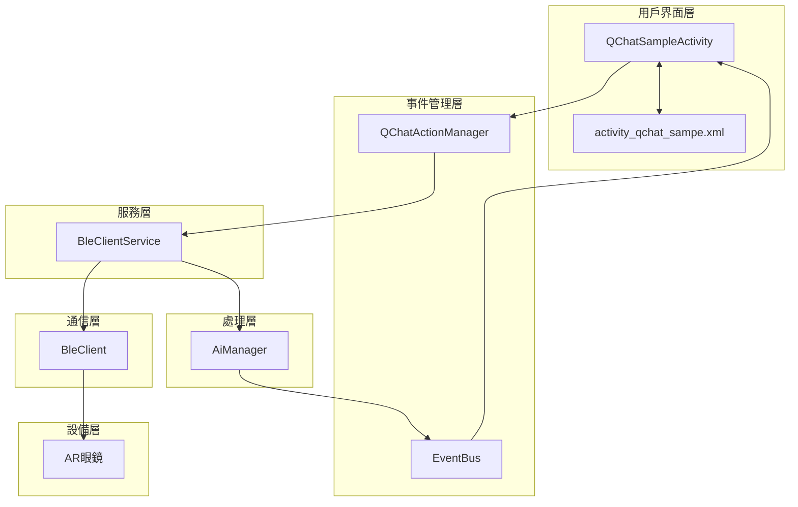

以上圖表全面展示了 QChatSampleActivity 的架構、流程和模組關係，清晰地說明了該活動如何與其他組件交互以實現與 AR 眼鏡的語音通信功能。

# CentralDemo Project Architecture

Based on my analysis of the project, I've created an architecture diagram and explanation for the CentralDemo project, which uses Bluetooth to communicate with Android AR glasses, with CentralLib as a submodule.

## Project Overview

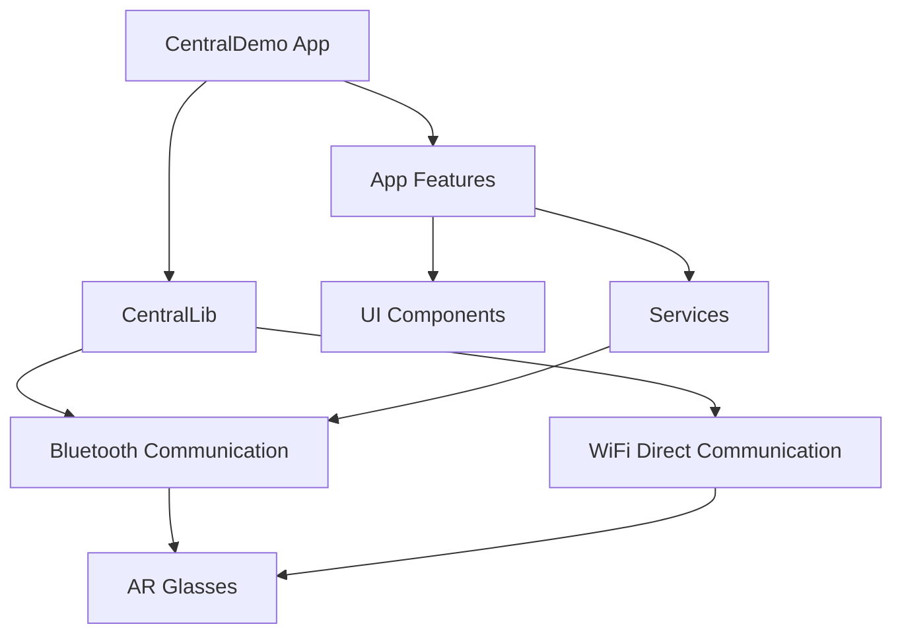

## System Architecture

The CentralDemo project is an Android application designed to communicate with AR glasses using both Bluetooth and WiFi Direct technologies. The architecture follows a modular approach with a clear separation between the main application and the communication library.

### Core Components

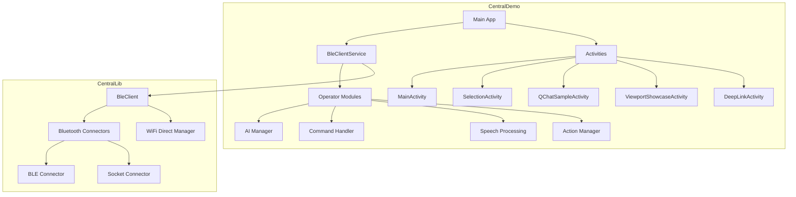

## Communication Flow

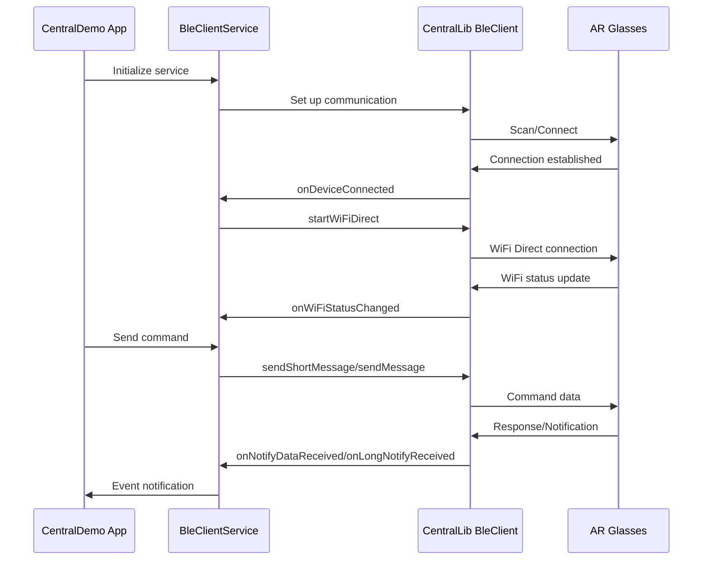

## Key Components

### 1. Main Application (app module)

The main application handles user interactions, UI components, and orchestrates the communication with AR glasses through the CentralLib module.

#### Key Classes:
- **BleClientService**: A foreground service that manages the Bluetooth connection lifecycle and handles communication with AR glasses.
- **Activities**: Various activities for different functionalities (Main, Selection, QChat, Viewport, DeepLink).
- **Operator Package**: Contains components for handling specific operations:
  - **AI Manager**: Processes AI-related commands and responses
  - **Command Handler**: Manages different types of commands (defined in CommandType enum)
  - **Action Manager**: Handles QChat actions and triggers

### 2. CentralLib Module

This is a submodule that encapsulates all the communication logic with AR glasses, abstracting the complexities of Bluetooth and WiFi Direct communications.

#### Key Classes:
- **BleClient**: The main class that handles all communication with AR glasses, supporting both Bluetooth and WiFi Direct.
- **Bluetooth Connectors**: 
  - **BleConnector**: Handles BLE (Bluetooth Low Energy) communication
  - **SocketConnector**: Manages Bluetooth Socket communication
- **WiFi Direct Manager**: Manages WiFi Direct connections for higher bandwidth data transfer

### 3. Communication Protocols

The system uses a dual-communication approach:
- **Bluetooth**: Used for initial connection, control commands, and smaller data transfers
- **WiFi Direct**: Used for higher bandwidth data transfers like images and videos

#### Message Types:
- **Short Messages**: Simple commands sent via Bluetooth (represented as byte arrays)
- **Long Messages**: JSON-formatted messages for complex data
- **Notifications**: Phone notifications forwarded to glasses
- **Images**: Image data transferred primarily via WiFi Direct when available

### 4. Application Types

The system supports various application types (defined in AppType enum):
- QR Scanner
- Settings
- Demo App
- Camera
- ChatGPT
- Picture Viewer
- Media Pipe
- Navigation Demo
- Video
- Translate
- SMS
- Menu Demo
- Voice Assistant
- AI Camera

### 5. Command System

Commands are sent to the glasses to trigger specific actions (defined in CommandType enum):
- Volume controls
- Translation
- QR Code scanning
- Video recording/playback
- Gesture recognition
- Navigation
- Picture viewing
- AI features (Ingredients analysis, Nutrition info, etc.)

## Data Flow

1. **Connection Establishment**:
   - App scans for available AR glasses devices
   - User selects a device to connect
   - BleClientService establishes Bluetooth connection
   - Once connected, WiFi Direct connection is attempted for higher bandwidth

2. **Command Execution**:
   - User triggers an action in the app
   - Command is sent to BleClientService
   - Service forwards command to CentralLib's BleClient
   - BleClient sends command to glasses via appropriate channel (Bluetooth/WiFi)

3. **Data Reception**:
   - Glasses send data/notifications back to the app
   - BleClient receives and processes the data
   - Callbacks notify BleClientService of received data
   - Service processes data and updates UI or triggers appropriate actions

4. **Media Handling**:
   - Images captured by glasses are sent back to the app
   - Images are processed by AI Manager if needed
   - Processed results are sent back to glasses for display

## Security and Permissions

The application requires numerous permissions for its functionality:
- Bluetooth permissions (BLUETOOTH, BLUETOOTH_ADMIN, BLUETOOTH_SCAN, BLUETOOTH_CONNECT)
- WiFi permissions (ACCESS_WIFI_STATE, CHANGE_WIFI_STATE)
- Location permissions (required for Bluetooth scanning)
- Notification access permissions
- SMS and call handling permissions
- Storage permissions for media handling

## Conclusion

The CentralDemo project demonstrates a sophisticated architecture for communicating with AR glasses using a dual-channel approach (Bluetooth and WiFi Direct). The modular design with CentralLib as a separate module provides good separation of concerns, making the codebase more maintainable and extensible.

The system supports a wide range of applications and commands, allowing for versatile interactions with AR glasses, from simple notifications to complex AI-powered features like translation, object recognition, and virtual try-on experiences.
